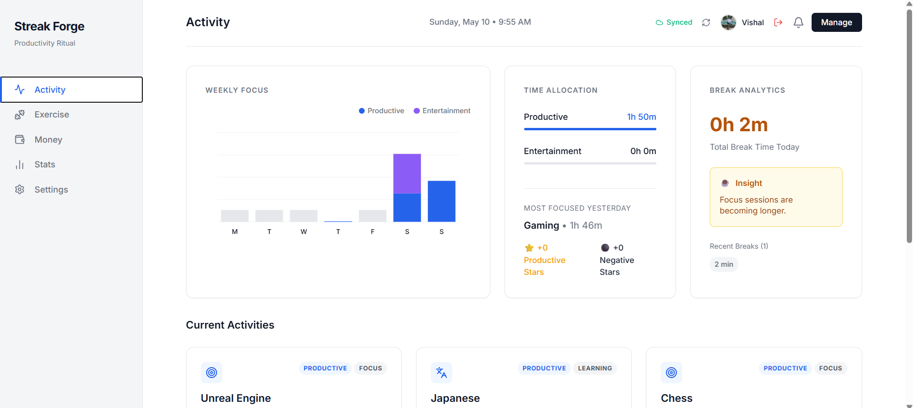

# ⚡ Streak Forge



**Live Demo:** [https://streak-forge-omega.vercel.app/](https://streak-forge-omega.vercel.app/)

> [!NOTE]
> **This project is Vibe Coded.** 🌊
> Built with intense focus on aesthetics, rapid iteration, and the perfect productivity "vibe".

Streak Forge is a minimal, powerful, and mobile-responsive productivity dashboard designed to help you build discipline through consistency. Track focus sessions, analyze work-life balance, log workouts, and monitor finances—all in a sleek, premium interface.

Streak Forge follows an **offline-first** philosophy, using local storage as the primary live state, with seamless **Firebase Cloud Sync** for cross-device backups.

## ✨ Features

### 📊 Activity Tracking & Focus Mode
- **Categorized Activities**: Manage activities by categorizing them as **Productive** or **Entertainment**. 
- **Zen Focus Timer**: A distraction-free floating timer to log your focus sessions, including support for breaks.
- **Balance Insights**: Real-time feedback calculating the ratio between your productive time and entertainment time.
- **Activity Streaks**: Maintain daily streaks for activities you log consistently.
- **Productivity Graph**: Custom HTML Canvas visualizations of your focus trends.

### 🏋️ Exercise & Nutrition Tracking
- **Workout Logging**: Log daily routines with sets and reps.
- **Hydration Tracking**: Quickly log glasses of water and monitor daily intake.
- **Meal Logging**: Track meals with smart categorization (High Protein, Balanced, Junk Food, etc.).

### 💰 Financial Dashboard
- **Intelligent Budgeting**: Set category budgets and watch real-time progress bars.
- **Dynamic Income Sources**: Track multiple income streams and their contributions.
- **Expense Tracking**: Log daily transactions with automatic balance calculations.

### 📈 Advanced Analytics
- **Weekly & Monthly Trends**: Deep dive into your performance over the last 7 or 30 days.
- **Dynamic Distribution**: Interactive pie charts for Activity and Subcategory breakdown.
- **Smart Insights**: Automatically generated text insights based on your performance trends.

### 📱 Mobile-First Design
- **Bottom Navigation**: Sleek, app-like bottom navigation bar on mobile devices.
- **Fully Responsive**: Optimized for every screen size, from desktop dashboards to handheld tracking.

## 🛠️ Technology Stack
- **React**: Component-based UI architecture.
- **Vite**: Ultra-fast frontend tooling.
- **Firebase**: Secure Google Sign-In and Firestore for multi-device synchronization.
- **Vanilla CSS**: Custom sleek UI with glassmorphism and modern aesthetics.
- **Lucide React**: Beautiful, consistent iconography.
- **Data Persistence**: Uses `localStorage` for live state and Firestore for cloud backups.

## 🚀 How to Run

1. Clone this repository to your local machine.
2. Install dependencies:
   ```bash
   npm install
   ```
3. Start the development server:
   ```bash
   npm run dev
   ```
4. Open your browser and start tracking!
